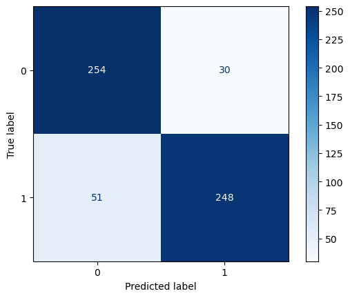
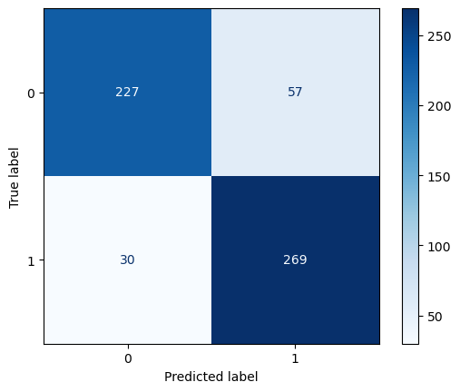

### Project 3 Elliott Jones ###

## Project contents ##
* data folder
  contains 7 csv files from different reddits and their top comments
  contains the csv file 'nostupidconcat.csv' where the data used in the notebook is exported with the features I explore
  contains the csv file No_stupid_questions_Davinci, where text answers from davinci are stored
* project 3 reddit api data gathering.ipynb
  a jupyter notebook where I gather the data
* data cleaning.ipynb 
  the notebook where the data cleaning and analysis takes place
* assets folder 
  Where images for the readme are stored
* README.md
  readme for the project
* lowcostopenapi
  a jupyter file where I attempted to implement the lower cost babbage model to get under 5$, this failed
* project_3.pdf
  a pdf with my slide file

## Project Statement Questions ##

#1. From exploring the data what features best indicate AI?
#2. What features am I targeting?
#3. Which models should we use, to help moderators automoderate bots on reddit?

## Executive Summary ##
In this project I'm trying to generate a model to automatically determine whether text responses are generated by humans or AI. As AI pr
In recent years chatbots and other types of spam bots have exploded across social media, making moderators jobs harder across these platforms, modeling tools that can automate these services would reduce workloads for often unpaid moderators.
Luckily, humans type incredibly differently from AI at least for now, this can be caught by word counters like CountVectorizers, and then modeled with Naive Bayes or Logistic Regression. The models for now can catch AI by the word choices it makes upwards of 85% of the time but AI will get better all the time.
I've identified 3 metrics of interest for further study, semicolons, abbreviations, and sentances without punctuation for further model review, 2 of those abbreviations and sentences bear further review. 
Sentences without punctuation are 20 to 1 human to AI, and further refinement of this parameter could give us a more accurate model.
For now though AI bots can continue to be caught be automoderators such as my model.

## Models ##

# MNB count vectorizor with Stopwords #

MNB stopword's best score is 84% and best estimators is max_features 2000

# Logistic Regression count vectorizor with stopwords #

Logsitic stopword's best score is 89% and best estimators is max_features 2000, this is my highest performing model

# MNB count vectorizor with stemming #

MNB stemming's best score is 87% and best estimators is max_features 1000 a slight difference from the other two.

## Conclusions ##

In conclusion, count vectorizers are still very good at catching AI language, it uses too many words humans don't use as often or shorthand, or uses those words too many times. So I would say given the accuracy of this model, automoderators are useful tools for moderators for at least the foreseeable future.